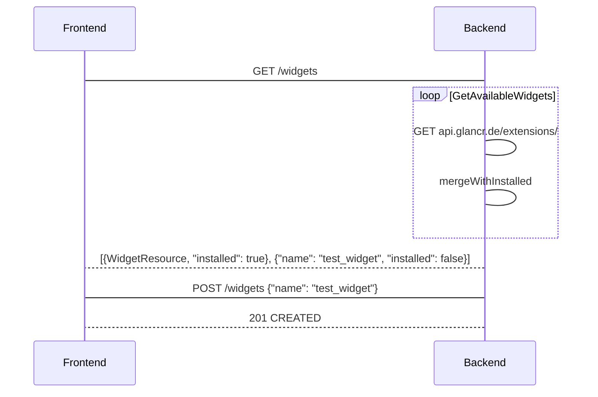
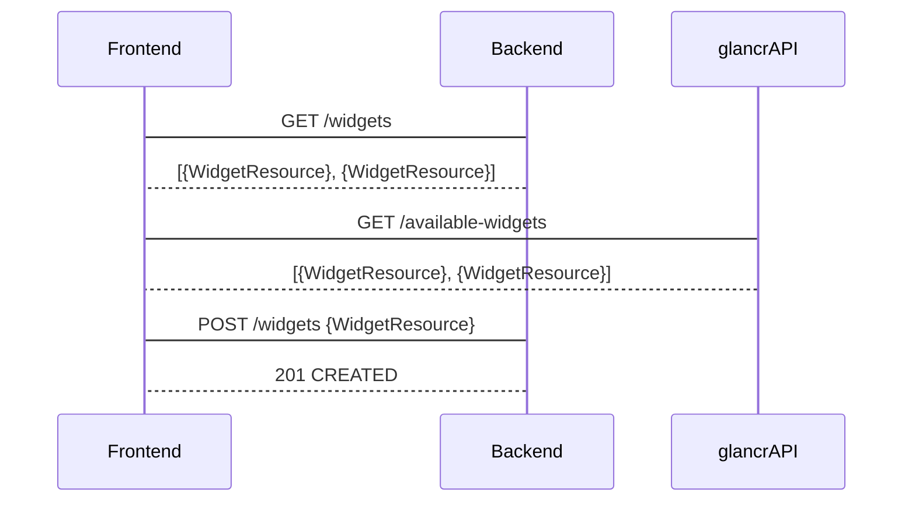

## Begriffe
* Extensions: Sammelbegriff für Widgets & Sources, d. h. Erweiterungen von mirr.OS die installiert werden können.
* Extension-Repo: Server, der fertig gebaute Extensions listet und ausliefert (z. B. `api.glancr.de/extensions`)
* FE/BE: Frontend/Backend

## Anforderungen & Einschränkungen
Die Implementierung für das Verwalten von in FE/BE muss folgende Anforderungen & Einschränkungen abbilden:
1. Liste aller *installierten* Extensions inkl. Metadaten
 1. Widgets: Nur installierte Widgets lassen sich im Layout-Screen instanziieren
 2. Sources: Nur installierte Sources lassen sich mit Einstellungen instanziieren
2. Liste *aller* (installierten & verfügbaren) Extensions inkl. Metadaten
 1. Widget- & Source-Verwaltung zeigen alle Extensions der jeweiligen Kategorie mit identischer Formatierung an. Dabei muss für das FE unterscheidbar sein, ob eine Extension installiert ist oder nicht.
3. Endpunkte, die JSON-Ressourcen liefern, sollten identisch typisierte Ressourcen ausliefern.
4. Das Installieren/Deinstallieren von Extensions muss ausreichend Metadaten mitliefern, um …
 1. im BE eine URL für den Download der Extension zu generieren oder eine übermittelte URL zu nutzen.
 2. eine bestimmte Version der Extension installieren zu können.
4. JSON:API Standard erlaubt nur `data` ODER `errors`, um „Erfolgreich abgeschlossen mit Fehlern“-Situationen zu vermeiden (weil das wieder zusätzliche Logik im FE erfordert).

Zudem sind folgende Szenarien/Fehlerquellen zu beachten:
1. api.glancr.de ist nicht erreichbar oder der Spiegel hängt in einem isolierten Netzwerk; Verwaltung der installierten Extensions muss weiter möglich sein. Nutzer soll (lokalisiert) informiert werden, dass externe Extensions gerade nicht geladen werden können.
2. Nutzer möchte eine andere Quelle anstelle von api.glancr.de angeben
 1. Andere Quelle für alle Extensions
 2. Installation einer einzelnen Extension aus anderer Quelle (HEAD direkt aus Git-Repo, privater „App Store“ usw.)
3. Die aktuellste Version einer Extension ist inkompatibel mit der installierten mirr.OS Version
4. URL-Struktur auf api.glancr.de ändert sich, bzw. generell möglichst wenig Kopplung an glancr.de [^1]

## Vor- & Nachteile beider Lösungen

### Verfügbare Extensions über das BE abrufen
#### Vorteile
* Weniger Logik im Frontend
* POST Request muss nicht JSON:API-konform sein, Extension-Name reicht
* Quelle der Extension-Metadaten ist ausschließlich die info.json der geladenen Extension; übermittelte Metadaten müssen nicht verglichen werden

#### Nachteile
* Controller Bloat: Dort muss …
 1. Ein switch entscheiden, ob alle oder nur die installierten Extensions geholt werden sollen (Anforderungen 1 & 2)
 1. Falls alle, dann die verfügbaren Widgets abgerufen werden
 2. Merge und zusätzliches Attribut, was nun installiert ist und was nicht
 3. Check auf Kompatibilität von mirr.OS und Extension (aber nur für die externen)
 4. Fehlerbehandlung, falls Extension-Repo Fehler liefert – gleichzeitig aber die installierten Extensions zeitnah ausliefern
 5. Anhand von 1-2 Parametern die gesamte Download-Logik umsetzen
* Szenario 1
 1. Abweichung von der JSON:API Spezifikation nötig: data UND error Attribute im Response-Objekt → zusätzliche Logik im Frontend, um beides auszuwerten
 2. Frontend bekommt keine Info, dass zusätzliche Extensions gerade nicht angezeigt werden können (silent fail)
 3. Fehlermeldung im `meta`-Attribut der Response: Muss jeder zukünftige Client für diese beiden Endpunkte gesondert implementieren, statt sich auf das `errors`-Attribut verlassen zu können.
* Szenario 2
 1. Einzelne Extension kann nicht aus anderer Quelle installiert werden, ohne vorher das BE neu zu konfigurieren
 2. Anderes Extension-Repository: Vorgabe des BE, statt dass alternative Clients es direkt angeben können
 3. Theoretisch könnten zwei Repos dieselbe Extension mit unterschiedlichem Code-Stand ausliefern – Client hat keine direkte Kontrolle darüber, welche nun installiert wird

### Verfügbare Extensions im FE abrufen, Kommunikation mit BE über qualifizierte Ressourcen
#### Vorteile
* Minimaler Anpassungsaufwand für das Zusammenspiel mit jsonapi-resources: Die Params werden einfach an `process_request` weitergegeben, statt im Controller eine JSON:API konforme Ressource aus den Metadaten der Extension bauen zu müssen
* Extension-Name und Version müssen ohnehin übermittelt werden, um die korrekte Datei aus dem Extension-Repo zu laden – Client kann also wahlweise auch eine unvollständige Ressource schicken: 

```json
{ 
  "data": {
    "type": "widgets",
    "attributes": {
      "name": "test_widget",      
      "version": "1.0.0"
    }
  }
}
```
* Szenario 2
 * Client kann je nach Extension definieren, aus welchem Repo zu installieren ist, bzw. auch für einzelne Quellen und Versionen
* Szenario 3
 * Extension-Repo kann im `meta`-Attribut zusätzliche Info wie z. B. kompatible mirr.OS Versionen ausliefern, ohne dass das Model diese abbilden muss.
* Differenzen der sonstigen (nicht verhaltensrelevanten) Metadaten wie Creator usw. kann das BE auch auflösen bzw. fehlerhafte Werte mit denen aus der Extension.gemspec überschreiben – *ohne* ein JSON:API Ressourcenobjekt zu bauen; das liegt aus dem POST schon vor und muss nur entsprechend modifiziert werden
* Näher am HATEOAS Constraint einer ordentlichen REST-Architektur:
 * https://spring.io/understanding/HATEOAS
 * https://en.wikipedia.org/wiki/HATEOAS


#### Nachteile
* Bestimmte Attribute der Extension-Ressourcen müssen im Model von der Modifikation ausgeschlossen werden, sonst könnte man z. B. PATCH {… "creator": "Ich ich ich"} rein hauen. Warum auch immer man das machen will :-)
* Nicht übermittelte oder abweichende Metadaten der POST-Ressource müssen im Controller korrigiert werden
* Client muss qualifizierte Ressourcen schicken, auch wenn die im Regelfall ja vom Extension-Repo fertig geliefert werden

### Architekturskizze „Backend liefert alle Widgets aus“


----

### Architekturskizze „Frontend fragt verfügbare Widgets direkt ab“


[^1]: Ich überlege, das FE für den fertigen glancr über app.glancr.de auszuliefern statt die Leute kompliziert über IP-Adressen zu leiten (.local geht ja auf Windows nach wie vor nicht). Dort wäre im Prinzip nur ein Skelett, das die Config-Variablen des FE für die Kopplung an glancr.de enthält und die FE-App über JS lädt. Alternative Clients könnten dementsprechend ihren eigenen Wrapper nutzen; die eigentliche FE-App auf dem Pi muss man dafür dann weder aktualisieren noch anpassen.