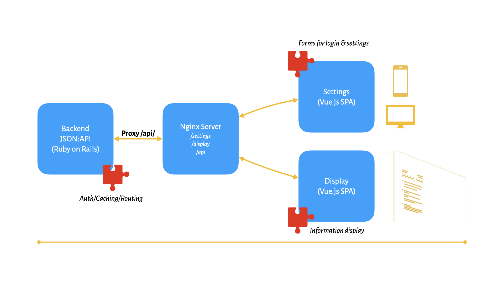
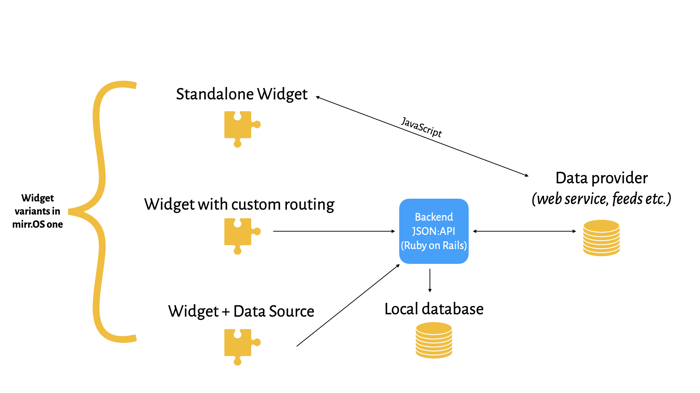

## Key concepts

mirr.OS is built with modularity in mind, as a completely decoupled web application stack. This way, the display and settings apps can be replaced or augmented for specialized use cases. All three parts can be extended to add functionality in defined ways.

Throughout this guide, we'll use calendar data as a practical example to explain mirr.OS concepts and data structures. Not only are calendars the data type most used and requested by mirr.OS users, but they bring a quite complex data model and edge cases that drove design decisions for mirr.OS. We'll use Google Calendar in the examples since it's the most popular web calendaring solution.

### Extensions
“Extension” is the umbrella term for widgets and sources. mirr.OS one is designed to provide flexible integration of different sources and widgets through a common data schema (see [Groups](#groups)).
Both extension types can be instantiated, i. e. a user can create multiple instances of each widget or source with different settings. For sources, this means they can add multiple accounts for the same data provider – different Google accounts for home and work, for example. Instances of a widget provide the same base view of the data, e. g. a view of today's events, but one can be configured to show calendar data from the home Google account while the other displays work data.

mirr.OS can dynamically (un)install extensions at runtime, which means that they can be distributed independently from mirr.OS core updates. To ensure all dependencies are installed and loaded, this requires a full bundler run and a backend restart – not very performant, so the shipped extensions are just toggled on/off.

Extensions are packaged as Ruby gems and must follow the application structure of a Rails engine. The glancr team runs a gem server to distribute extensions, but the mirr.OS backend can be configured to use other gem sources.

#### Sources
Source-type extensions provide the required logic to fetch data from an external data provider, e. g. Google Calendar. 
A source extension must implement a number of hooks that are called by mirr.OS to trigger data refreshes, validate the user's credentials or fetch the available options – all calendars available for a user's Google account, for example.
Since the authentication process might be  Sources do *not* provide any display logic, only 

#### Widgets
Widgets – or rather, its instances – control how data is displayed on the frontend through a Vue.js component template. Widgets can also provide customizations for the display, e. g. whether to show or hide passed calendar events in a “Today” view. It's up to the widget developer which display customizations are offered. The mirr.OS settings app provides a drag'n'drop UI to place widget instances on the available screen.

##### Integrated vs. stand-alone widgets
As a widget developer, you can decide whether you want to integrate your widget with data sources from other extensions or not. 

In the first case, you only need to specify the group schemas that your widget can handle (see [Groups](#groups)). When a user configures an instance of your widget, mirr.OS will automatically show all compatible sources that are installed on the user's system. Once the user chooses sources to display through your widget, the data is passed to your widget's frontend template in the specified group schema.

If your widget is designed for a very specific use-case, e. g. you have a custom service that does not fit any of the provided groups and thus cannot be shared with other widgets, you may opt for a stand-alone widget. In that case, your frontend template will only receive the user's configuration choices for the widget instance, and your front-end code needs to provide all required processing and refresh logic. Since widgets are packaged as Rails Engines, you may also leverage backend-side code and custom endpoints – but this is currently out of scope for this guide. Please refer to the [official Rails Engine guide](https://guides.rubyonrails.org/engines.html) for details.

### Groups
Groups determine which sources and widgets are compatible in terms of the data type(s) they provide or consume.

Each source that provides data for a group schema can be displayed by widgets that handle the same schema. Sources can provide multiple group schemas, but widgets are constrained to one schema to keep the UI clear and the data model more manageable (though this may change in future versions).